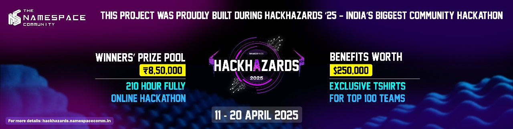

🚨 Emergency SOS Network

Empowering communities with real-time disaster response through AI-driven prioritization and interactive mapping.

📌 Problem Statement

Problem Statement 12 – Redesign Crisis Logistics and Relief Distribution

🎯 Objective

In disaster situations, timely and efficient response is crucial. The Emergency SOS Network addresses this by providing a platform that:

* Tracks emergencies in real-time using geolocation.
  
* Prioritizes incidents based on severity through AI analysis.
 
* Facilitates rapid response by visualizing data on an interactive map.
 
* This system serves first responders, emergency services, and affected communities, ensuring that critical situations receive immediate attention.

🧠 Team & Approach

Solohacker

Name : JAYADIXITHA S P

Approach:

* Problem Selection: Chose this challenge to enhance disaster response efficiency.

* Challenges Addressed:

  -> Integrating real-time data visualization.

   -> Implementing AI for incident prioritization.

   -> Ensuring user-friendly interface for diverse users.

* Development Journey:

  -> Transitioned from a multi-file setup to a streamlined single-file Flask application.

  -> Iteratively tested features to ensure reliability and responsiveness.

🛠️ Tech Stack

Frontend: HTML, CSS, JavaScript, Leaflet.js

Backend: Python, Flask

Database: SQLite

APIs:

* OpenStreetMap for mapping.

* Google Speech Recognition for voice input.

* GeoAPI for location services.

Hosting: Render 

✨ Key Features

✅ Live Emergency Map: Visual representation of ongoing incidents.

✅ AI-Powered Prioritization: Automated assessment of incident severity.

✅ Voice Input: Report emergencies hands-free.

✅ Interactive Dashboard: User-friendly interface for monitoring and response.

📽️ Demo & Deliverables

Demo Video: https://vimeo.com/1078024820?share=copy

Pitch Deck: [Insert Link]

✅ Tasks & Bonus Checklist

✅ Followed required social channels and submitted the form.

✅ Completed Bonus Task 1 – Shared badges and submitted the form.

✅ Completed Bonus Task 2 – Signed up for Sprint.dev and submitted the form.

🧪 How to Run the Project

Requirements:

* Python 3.9+

* Internet connection for API access

Local setup:

* bash

* Copy

* Edit
  
# Clone the repository
git clone https://github.com/123-jaya/Emergency-SOS-Network.git

# Navigate to the project directory
cd Emergency-SOS-Network

# Install dependencies
pip install -r requirements.txt

# Run the application
python app.py

🧬 Future Scope

📱 Develop a mobile application for on-the-go reporting.

🌐 Integrate multilingual support for broader accessibility.

🔒 Enhance security features for data protection.

🤖 Incorporate machine learning for predictive analysis.

📎 Resources / Credits

APIs: 

OpenStreetMap, GeoAPI

Libraries:

Flask, SQLite, Leaflet.js

Acknowledgements: 

Gratitude to HACKHAZARDS'25 mentors and the developer community for their support.

🏁 Final Words

Participating in HACKHAZARDS'25 has been an enlightening experience. From conceptualization to execution, our team collaborated to create a solution aimed at making a tangible difference in emergency response. 
We're proud of what we've built and excited about its potential impact.
